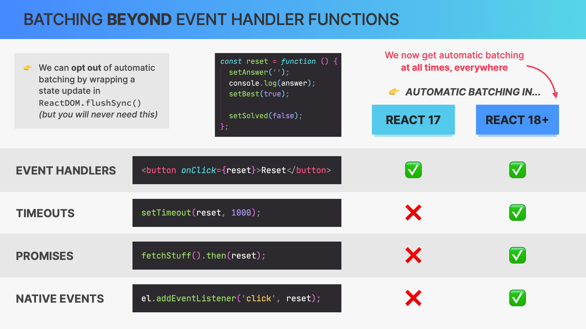
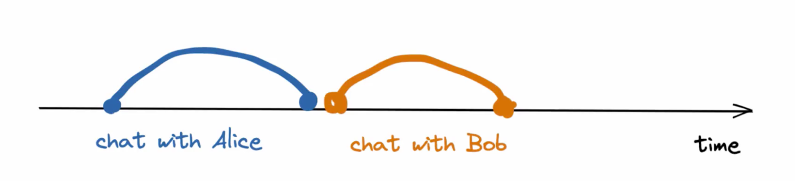
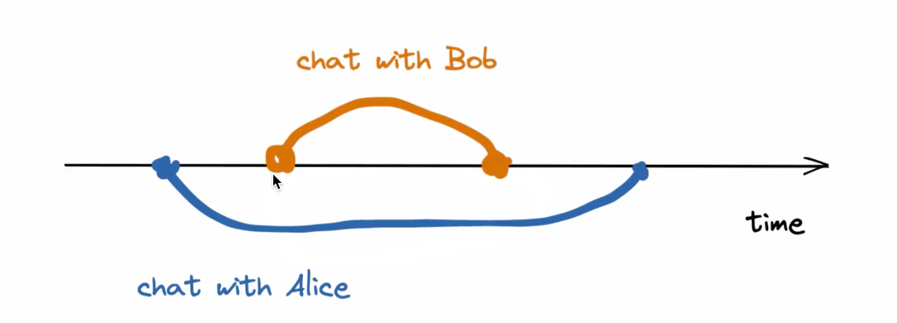
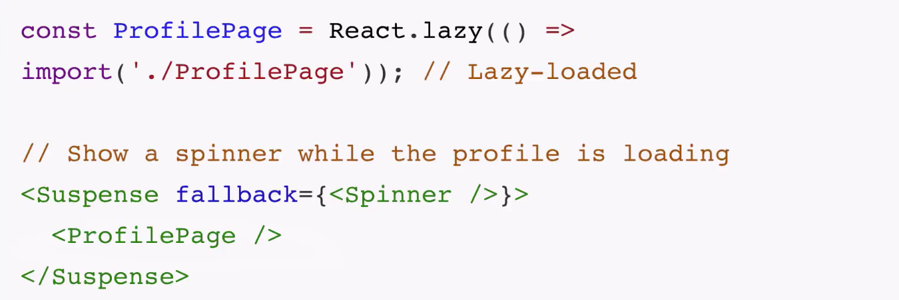

# NEW FEATURES IN REACT18

## AUTOMATIC BATCHING



## TRANSITIONS

### Cocurrent

React 18 introduces a new feature known as "concurrent rendering" (also referred to as "Concurrent Mode") which helps to make user interfaces more responsive by making rendering interruptible and by enabling React to keep the UI responsive even when there's a lot going on in the background.

Prior to React 18, when you started rendering in React, it would block the main thread until the render was complete. This could lead to a poor user experience because while the rendering is taking place, the browser can't respond to user interactions like clicks or scrolls, which makes the UI feel sluggish or unresponsive.

Concurrent rendering, on the other hand, changes this behavior. When React starts rendering, it doesn't block the main thread until it's done. Instead, it breaks the rendering work into smaller tasks and intersperses them with tasks that handle user interactions. If a high-priority update (like a user interaction) comes in, React can pause the ongoing render, handle the high-priority update, and then resume the render where it left off. This helps to keep the UI responsive even under heavy load.

This concurrent behavior is controlled through a new API introduced in React 18 called `startTransition`. This API lets you specify updates that you're okay with being delayed if the browser is busy with other tasks.

Here is a simple example:

```javascript
import { startTransition } from "react";

function MyButton({ setIsPending, fetchNewData }) {
  const handleClick = () => {
    startTransition(() => {
      setIsPending(true);
      fetchNewData().finally(() => {
        setIsPending(false);
      });
    });
  };

  return <button onClick={handleClick}>Fetch Data</button>;
}
```

In this example, `startTransition` will indicate to React that the state update can be delayed, and so the UI remains responsive throughout the data fetching process.

It's important to note that concurrent rendering is an advanced feature and is optional - you can choose to use it only for certain parts of your app where you need that level of control.



**Concurrency refers to the ability to handle multiple tasks, not processing them simultaneously, but potentially handling them alternately, processing one task at a time in any order of priority.**

### Transition

In order to distinguish between urgent and non-urgent updates, React has introduced a new concept called transition.

Transition updates move the user interface (UI) from one view to another.
Urgent updates reflect direct input, such as typing, clicking, pressing, etc.
So let me give you an example: if you are doing a task and another urgent task comes in that has a higher priority, react will stop that task and work on the higher priority task and then start that task again

```typescript
function App() {
  const [isPending, startTransition] = useTransition();
  const [input, setInput] = useState("");
  const [data, setData] = useState<number[]>([]);

  const updateHandler = (e: React.ChangeEvent<HTMLInputElement>) => {
    const value = e.target.value;
    setInput(value);
    startTransition(() => {
      const arr = Array.from(
        { length: 10000 },
        (_, i) => new Date().getTime() + i
      );
      setData(arr);
    });
  };

  return (
    <>
      <div className="card">
        <input type="text" value={input} onChange={updateHandler}></input>
        {isPending
          ? "Pending..."
          : data.map((d) => <option key={d}>{d}</option>)}
      </div>
    </>
  );
}
```

## SUSPENSE API

### Dynamically loading component



### Fetching Data Async(Experimental)

Suspense lets your components "wait" for something before they can render.

```typescript
// needs isLoading to record the state whether loading finished or not
const [todos, isLoaing] = fetchData("/todos");

if (isLoading) {
  return <Spinner />;
}

return <Todos data={todos} />;
```

Using suspense

```typescript
const todos = fetchData("/todos")

return (

  <Suspense fallback={<Spinner />}>
    //Todos component can tell Suspense whether the data has been fetched or not
    <Todos data={todos} />
  <Suspense>
)

```
